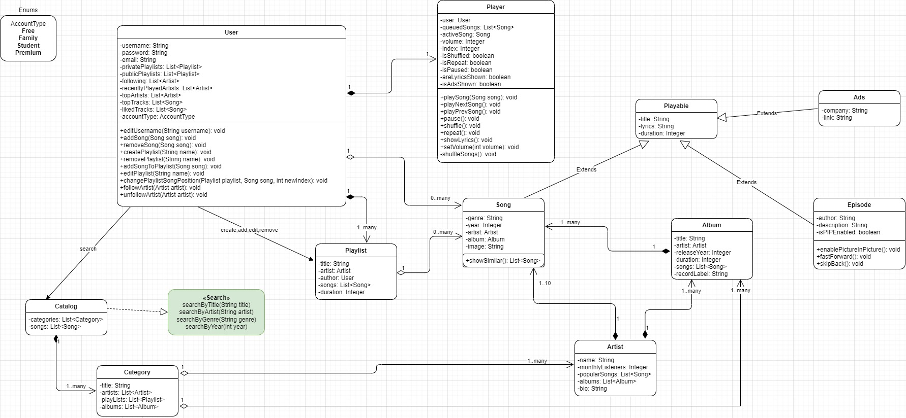

# Spotify 

#### Customer Use-cases
<ul>
    <li>Edit profile</li>
    <li>Add a song</li>
    <li>Delete a song</li>
    <li>Play a song</li>
    <li>Create a playlist</li>
    <li>Remove a playlist</li>
    <li>Add a song to a playlist</li>
    <li>Edit (photo, name...) a playlist</li>
    <li>Change song position in a playlist</li>
    <li>Follow/unfollow an artist</li>
    <li>Play an album</li>
    <li>Search by title/artist/genre</li>
</ul>

#### Classes
<ul>
    <li>User</li>
    <li>Player</li>
    <li>AccountType (enum)</li>
    <li>Song</li>
    <li>Album</li>
    <li>Playlist</li>
    <li>Artist</li>
    <li>Catalog</li>
    <li>Category</li>
    <li>Search (interface)</li>
    <ul>
        <li>By title</li>
        <li>By artist</li>
        <li>By genre</li>
        <li>By date</li>
    </ul>
</ul>